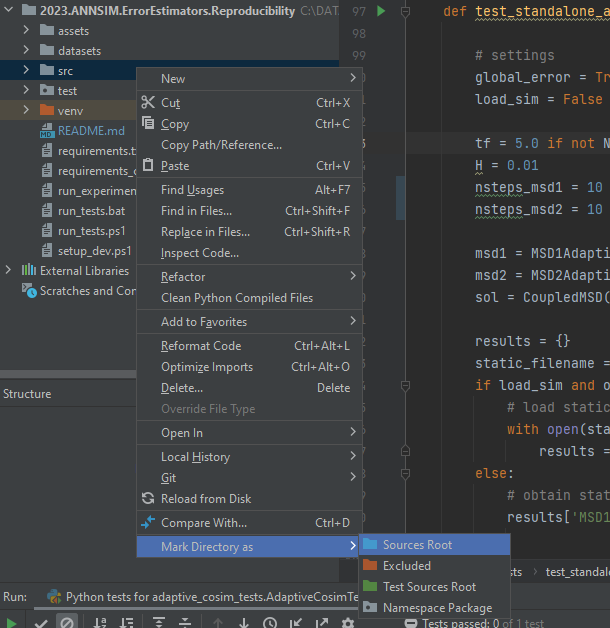
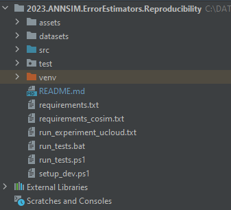
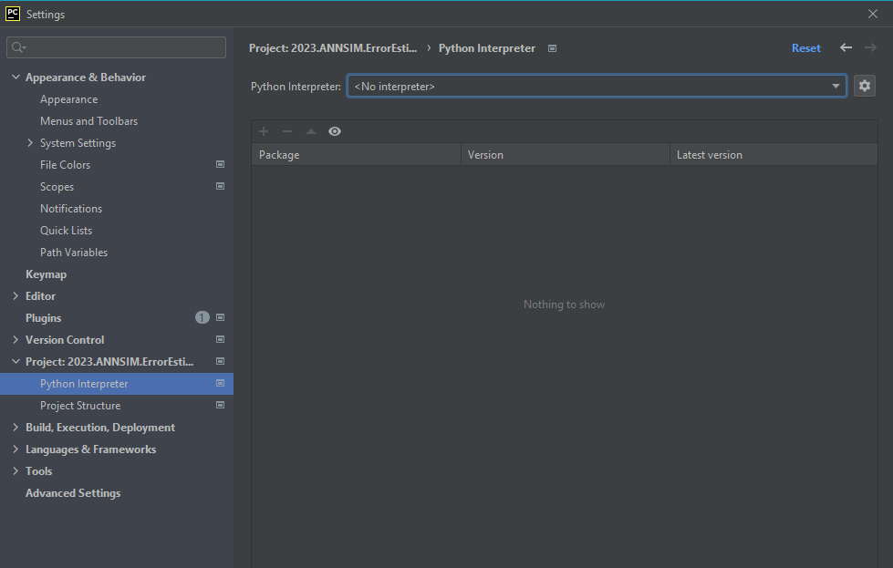
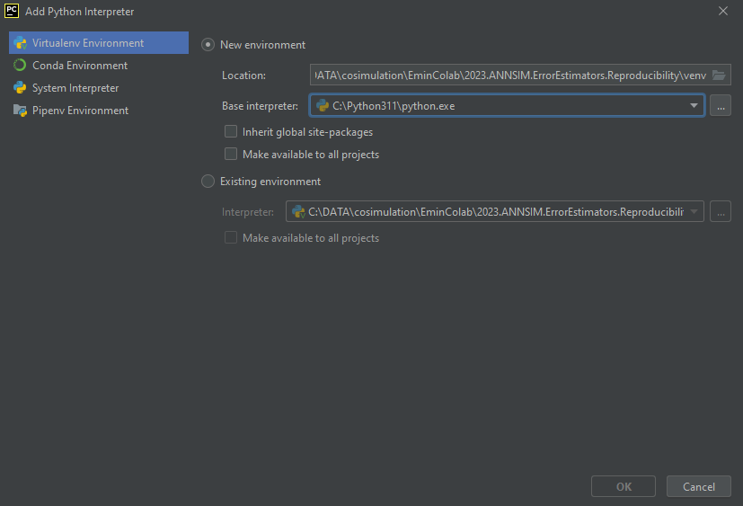
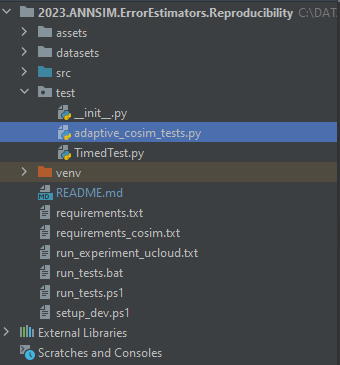
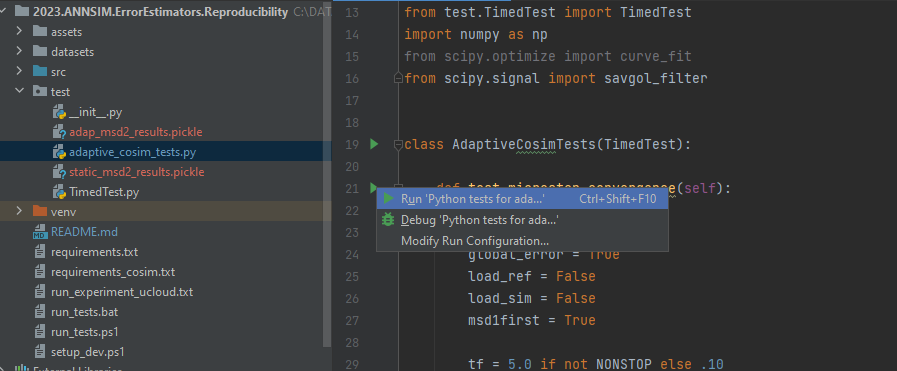
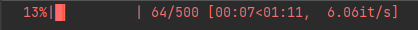
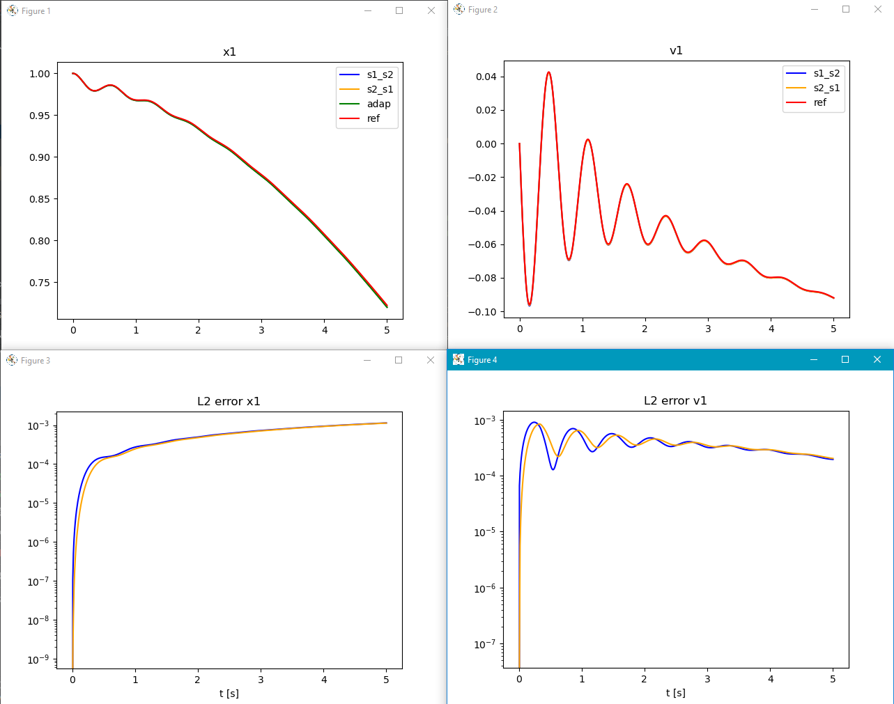

# 2023.ANNSIM.ErrorEstimators.Reproducibility

## Code Description

### Parameter Set Results

* The selection of the initial conditions (`X0`) and the parameter values (`COSIM_PARAMS`) can be done in `./src/sys_params.py`.  
There you can find the parameter sets that are listed in the paper. However, you can still modify them and play with system parameters of the mass-spring-damper systems. 

* The linear MSD system model is simulated in `./test/adaptive_cosim_tests.py` file. 

* The function `test_run_adaptive_cosim_power_input` benchmarks adaptive scheduling algorithms (input estimation and power transfer) against static co-simulation sequences for the given linear problem.

* The requested plots can be switched on/off by setting the boolean variables `True` or `False`.

### Parameter Sweep Results

The parameter sweep results can be obtained by running the `parameter_sweep.py` in `src` folder.
This file runs the system with random parameters to obtain the effect of the parameters on co-simulation accuracy and sequence selection.
However, this file produces only the raw simulation result data. 
In order to post-process the data and obtain the figures in the paper, the user must run `analyze_parameter_sweep_results.py` in `src` folder.
This python file can post_process the data into meaningful expressions, e.g. extracting the best sequence at a time, as well as plotting them, e.g. plotting the frequency of adaptive algorithm staying as the best sequence.

## Running the Code

**Note:** Some of the plots require Latex. Please download MikTeX from [the website](https://miktex.org/download).

### From command line

Setup environment (see [setup_dev.ps1](experiments\setup_dev.ps1)):
1. Open command line in experiments folder.
2. Create a python virtual environment: `python -m venv venv`
3. Activate the python virtual environment. Run one of the scripts in  `./venv/scripts/activate*`
4. Install packages required with pip.
5. Run the unit test desired:  `python -m unittest test.cosimulation_solution.MyTestCase.test_show_l2_error`
6. Or run all tests: see the file [run_tests.ps1](experiments\run_tests.ps1) 

### From PyCharm IDE

#### First Time Setup

To configure the experiments folder as a PyCharm project for the first time, follow the steps:

1. Open PyCharm and File -> Open
2. Put the path of the repository folder: for example -> C:\DATA\2023.ANNSIM.ErrorEstimators.Reproducibility and press OK
3. Don't forget to label `./src` folder as source root:

	

4. Once opened, you should see something like this:
   
   

5. Now it's time to configure a virtual environment. This is optional, but highly recommended to avoid cluttering your python installation with lots of packages that are not used in other python projects.
6. Go to File -> Settings -> Project: 2023.ANNSIM.ErrorEstimators.Reproducibility -> Project Interpreter
7. Press add:
   
   

8. Configure and press OK on the following window:

   

   Note: If you already have a dedicated Anaconda environment, you can also set it with a newer version of Python 3.8 or higher.

9. Wait a bit as it make take a while for the virtual environment to be created.

10. You should also see a folder called "venv" inside the experiments folder.
11. Now you'll have to install the dependencies into the virtual environment.
12. The IDE does this for you automatically. By trying to run the tests, you'll quickly find which packages are missing and the IDE will offer to install them.

#### Workflow

Once configured, you see something similar to:

To run a particular test, go to test/adaptive_cosim_tests, and the IDE should give you a shortcut to run each test:

After clicking run, you should see the results and progress in the lower bar:

## Managing dependencies

Dependencies are in the [requirements.txt](experiments\requirements.txt) file. 

